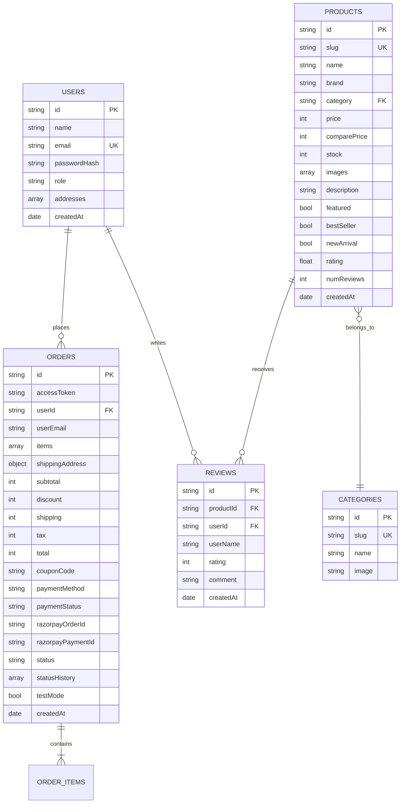
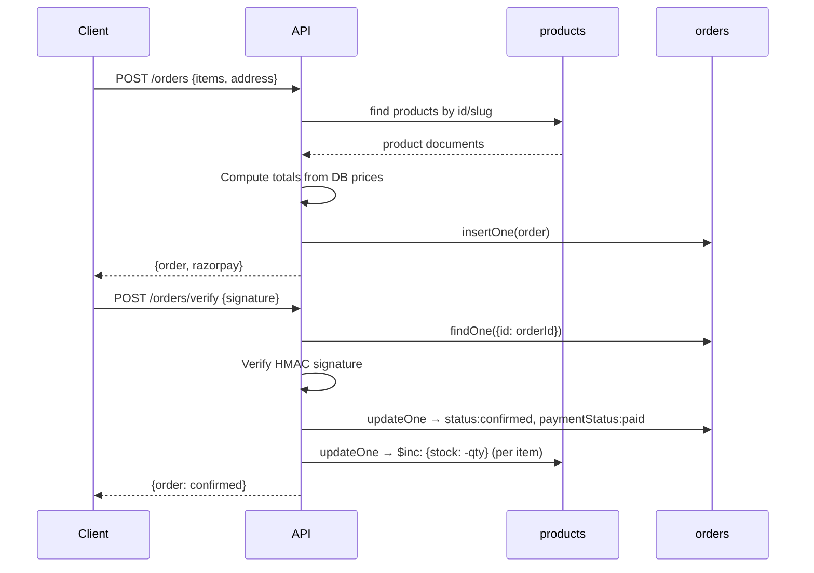
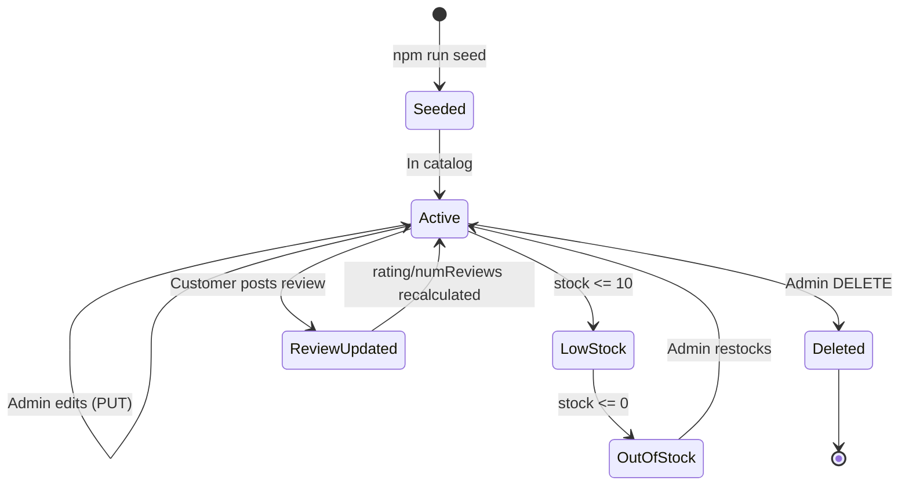
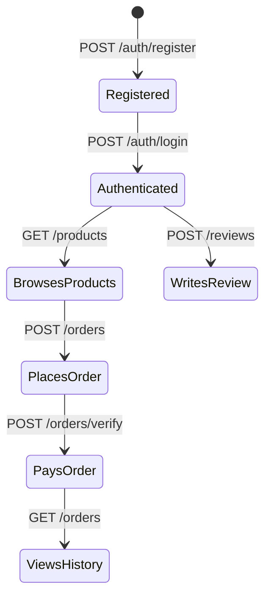

# Database Documentation

Internal database engineering documentation for **Lumen Commerce**.

Database: MongoDB 6.6 (driver-based, no ODM)

---

## 1. Database Overview

| Property | Value |
|----------|-------|
| Engine | MongoDB 6.6 |
| Default name | `lumen_commerce` |
| Driver | `mongodb` npm package (native driver) |
| ORM/ODM | None — raw driver queries |
| ID strategy | UUID v4 (stored as `id` string field) |
| Connection | Lazy singleton on `globalThis`, 5s timeout |
| Schema enforcement | Application-level only (no JSON Schema validation) |

### Collections

| Collection | Documents (seeded) | Purpose |
|------------|-------------------|---------|
| `products` | 12 | Product catalog |
| `categories` | 6 | Product category definitions |
| `users` | 1 (admin) | User accounts |
| `orders` | 0 | Purchase records |
| `reviews` | 0 | Product reviews |

### Design Decisions

- **UUID over ObjectId** — Application-generated `id` field for portability. MongoDB `_id` (ObjectId) is auto-created but stripped from API responses.
- **No schema validation** — MongoDB stores documents as-is. Validation happens in the API handler before writes.
- **Denormalization** — Order items embed product snapshots (name, price, image) to preserve historical accuracy when products change.
- **No foreign key enforcement** — Relationships are by convention (e.g., `order.userId` references `user.id`).

---

## 2. Entity Relationship Diagram



---

## 3. Users Collection

### Purpose

Stores customer and admin accounts. Authenticated via bcrypt password hashes and JWT tokens.

### Schema

| Field | Type | Required | Default | Description |
|-------|------|----------|---------|-------------|
| `id` | string (UUID) | Yes | Generated | Application-level primary key |
| `name` | string | Yes | — | Display name |
| `email` | string | Yes | — | Login identifier (unique) |
| `passwordHash` | string | Yes | — | bcrypt hash (cost factor 10) |
| `role` | string | Yes | `"customer"` | `"customer"` or `"admin"` |
| `addresses` | array | Yes | `[]` | Saved shipping addresses |
| `createdAt` | Date | Yes | `new Date()` | Registration timestamp |

### Indexes

| Fields | Type | Purpose |
|--------|------|---------|
| `{ email: 1 }` | Unique | Login lookup, duplicate prevention |

### Sample Document

```json
{
  "_id": "ObjectId(...)",
  "id": "b69f10ea-3f5c-4934-b260-12076dfa8a75",
  "name": "Admin",
  "email": "admin@lumen.shop",
  "passwordHash": "$2b$10$48ucNQhPh8TsMc8q5kAVp...",
  "role": "admin",
  "addresses": [],
  "createdAt": "2026-06-25T15:45:26.247Z"
}
```

### Notes

- `passwordHash` is stripped by `clean()` before any API response
- `_id` is stripped by `clean()` before any API response
- Role is embedded in JWT payload — no DB lookup needed for authorization checks
- No email verification flow exists

---

## 4. Products Collection

### Purpose

Product catalog. Queried on every storefront page load. Prices are in INR (integer, paise not used — ₹8999 = 8999).

### Schema

| Field | Type | Required | Default | Description |
|-------|------|----------|---------|-------------|
| `id` | string (UUID) | Yes | Generated | Primary key |
| `slug` | string | Yes | — | URL-safe identifier (unique) |
| `name` | string | Yes | — | Product title |
| `brand` | string | Yes | — | Brand name |
| `category` | string | Yes | — | Category slug (references `categories.slug`) |
| `price` | number | Yes | — | Selling price in ₹ |
| `comparePrice` | number | No | `0` | Original/MRP price for discount display |
| `stock` | number | Yes | — | Available units |
| `images` | array[string] | Yes | — | Image URLs |
| `description` | string | Yes | — | Product description |
| `featured` | boolean | No | — | Show in featured section |
| `bestSeller` | boolean | No | — | Show in best sellers |
| `newArrival` | boolean | No | — | Show in new arrivals |
| `rating` | number | Yes | `0` | Average rating (recomputed on review) |
| `numReviews` | number | Yes | `0` | Review count (recomputed on review) |
| `createdAt` | Date | Yes | `new Date()` | Creation timestamp |

### Indexes

| Fields | Type | Purpose |
|--------|------|---------|
| `{ slug: 1 }` | Unique | Product detail lookup by URL |
| `{ id: 1 }` | Unique | Direct lookup by UUID |
| `{ category: 1, featured: -1, rating: -1 }` | Compound | Featured products by category |
| `{ category: 1, createdAt: -1 }` | Compound | New arrivals by category |

### Sample Document

```json
{
  "_id": "ObjectId(...)",
  "id": "eb5682d8-d3f7-4c0a-b7ff-95e8401e5023",
  "slug": "heritage-leather-watch",
  "name": "Heritage Leather Watch",
  "brand": "Lumen",
  "category": "accessories",
  "price": 8999,
  "comparePrice": 14999,
  "stock": 24,
  "images": ["https://images.unsplash.com/photo-1542496658-e33a6d0d50f6"],
  "description": "A timeless leather strap watch with sapphire crystal and Japanese movement.",
  "featured": true,
  "bestSeller": true,
  "rating": 4.8,
  "numReviews": 128,
  "createdAt": "2026-06-25T15:45:26.000Z"
}
```

### Query Patterns

| Operation | Query | Index Used |
|-----------|-------|-----------|
| Shop listing (featured sort) | `find({category}).sort({featured:-1, rating:-1})` | `category_1_featured_-1_rating_-1` |
| Product detail | `findOne({slug})` | `slug_1` |
| Order validation | `find({$or: [{id: {$in}}, {slug: {$in}}]})` | `id_1` + collection scan on slug |
| Admin inventory | `find({}).toArray()` | Full scan |

---

## 5. Categories Collection

### Purpose

Product grouping for navigation and filtering.

### Schema

| Field | Type | Required | Description |
|-------|------|----------|-------------|
| `id` | string | Yes | Matches slug (e.g. `"men"`) |
| `slug` | string | Yes | URL-safe key (unique) |
| `name` | string | Yes | Display name |
| `image` | string | Yes | Category hero image URL |

### Indexes

| Fields | Type | Purpose |
|--------|------|---------|
| `{ slug: 1 }` | Unique | Lookup and dedup |

### Sample Document

```json
{
  "_id": "ObjectId(...)",
  "id": "electronics",
  "slug": "electronics",
  "name": "Electronics",
  "image": "https://images.unsplash.com/photo-1545127398-14699f92334b"
}
```

### Notes

- Categories are static in this implementation (seeded, no admin CRUD)
- `id` equals `slug` for categories (unlike other collections which use UUID)
- Products reference categories via `product.category === category.slug`

---

## 6. Orders Collection

### Purpose

Stores purchase records including payment status, shipping info, and order lifecycle history.

### Schema

| Field | Type | Required | Description |
|-------|------|----------|-------------|
| `id` | string (UUID) | Yes | Primary key |
| `accessToken` | string (UUID) | Yes | Guest access token for order lookup |
| `userId` | string (UUID) | No | References `users.id` (null for guest) |
| `userEmail` | string | Yes | Customer email |
| `items` | array[OrderItem] | Yes | Embedded product snapshots |
| `shippingAddress` | object | Yes | Delivery address |
| `billingAddress` | object | Yes | Billing address |
| `subtotal` | number | Yes | Sum of (price × qty) |
| `discount` | number | Yes | Coupon discount amount |
| `shipping` | number | Yes | Shipping fee (0 if subtotal > 1500) |
| `tax` | number | Yes | 5% of (subtotal - discount) |
| `total` | number | Yes | Final charge amount |
| `couponCode` | string | No | Applied coupon |
| `paymentMethod` | string | Yes | `"razorpay"` |
| `paymentStatus` | string | Yes | `"pending"` or `"paid"` |
| `razorpayOrderId` | string | No | Razorpay order reference |
| `razorpayPaymentId` | string | No | Razorpay payment reference |
| `status` | string | Yes | Current order status |
| `statusHistory` | array[{status, at}] | Yes | Audit trail of status changes |
| `testMode` | boolean | Yes | Whether payment was simulated |
| `createdAt` | Date | Yes | Order placement time |

### OrderItem (embedded)

| Field | Type | Description |
|-------|------|-------------|
| `productId` | string | `products.id` reference |
| `name` | string | Product name snapshot |
| `slug` | string | Product slug snapshot |
| `image` | string | First image URL snapshot |
| `price` | number | Price at time of purchase |
| `qty` | number | Quantity ordered |

### Indexes

| Fields | Type | Purpose |
|--------|------|---------|
| `{ id: 1 }` | Unique | Direct lookup |
| `{ userId: 1, createdAt: -1 }` | Compound | User's order history |
| `{ paymentStatus: 1, createdAt: -1 }` | Compound | Admin revenue queries |

### Order Status Values

```
pending → confirmed → packed → shipped → out_for_delivery → delivered
pending → cancelled
confirmed → cancelled
delivered → refunded
```

### Sample Document

```json
{
  "_id": "ObjectId(...)",
  "id": "a7e9f0c2-1234-5678-9abc-def012345678",
  "accessToken": "b8f1a2c3-...",
  "userId": "b69f10ea-...",
  "userEmail": "admin@lumen.shop",
  "items": [
    {
      "productId": "eb5682d8-...",
      "name": "Heritage Leather Watch",
      "slug": "heritage-leather-watch",
      "image": "https://images.unsplash.com/photo-1542496658-e33a6d0d50f6",
      "price": 8999,
      "qty": 1
    }
  ],
  "shippingAddress": {
    "fullName": "Admin",
    "email": "admin@lumen.shop",
    "phone": "9876543210",
    "line1": "123 Main St",
    "city": "Mumbai",
    "state": "MH",
    "pincode": "400001",
    "country": "India"
  },
  "billingAddress": { "..." : "same as shipping" },
  "subtotal": 8999,
  "discount": 0,
  "shipping": 0,
  "tax": 450,
  "total": 9449,
  "couponCode": null,
  "paymentMethod": "razorpay",
  "paymentStatus": "paid",
  "razorpayOrderId": null,
  "razorpayPaymentId": "SIM_1719345600000",
  "status": "confirmed",
  "statusHistory": [
    { "status": "pending", "at": "2026-06-25T20:00:00.000Z" },
    { "status": "confirmed", "at": "2026-06-25T20:00:05.000Z" }
  ],
  "testMode": true,
  "createdAt": "2026-06-25T20:00:00.000Z"
}
```

---

## 7. Reviews Collection

### Purpose

Product reviews submitted by authenticated users. Reviews trigger recomputation of `products.rating` and `products.numReviews`.

### Schema

| Field | Type | Required | Description |
|-------|------|----------|-------------|
| `id` | string (UUID) | Yes | Primary key |
| `productId` | string | Yes | References `products.id` |
| `userId` | string | Yes | References `users.id` |
| `userName` | string | Yes | Display name snapshot |
| `rating` | number | Yes | 1–5 star rating |
| `comment` | string | Yes | Review text (can be empty) |
| `createdAt` | Date | Yes | Submission time |

### Indexes

| Fields | Type | Purpose |
|--------|------|---------|
| `{ productId: 1, createdAt: -1 }` | Compound | Product review listing (newest first) |

### Sample Document

```json
{
  "_id": "ObjectId(...)",
  "id": "r1a2b3c4-...",
  "productId": "eb5682d8-...",
  "userId": "b69f10ea-...",
  "userName": "Admin",
  "rating": 5,
  "comment": "Excellent build quality.",
  "createdAt": "2026-06-25T21:00:00.000Z"
}
```

### Side Effects

On every review insert, the API handler:
1. Fetches all reviews for the product
2. Computes average rating
3. Updates `products.rating` and `products.numReviews`

```javascript
const avg = reviews.reduce((a, x) => a + x.rating, 0) / reviews.length
await db.collection('products').updateOne(
  { id: productId },
  { $set: { rating: Math.round(avg * 10) / 10, numReviews: reviews.length } }
)
```

---

## 8. Collections NOT Implemented

The following are managed client-side or do not exist as collections:

| Feature | Storage | Notes |
|---------|---------|-------|
| Wishlist | `localStorage` (key: `lumen-wishlist`) | Array of product IDs/slugs in Zustand store |
| Cart | `localStorage` (key: `lumen-cart`) | Full cart items with qty in Zustand store |
| Payments | Embedded in `orders` | No separate payments collection; payment data lives on order documents |
| Settings | None | Admin settings panel is UI-only (no persistence) |
| Sessions | None | Stateless JWT auth, no server sessions |
| Coupons | Hardcoded | Defined in API route handler, not in database |

---

## 9. Data Flow

### Order Lifecycle



### Product Lifecycle



### User Lifecycle



---

## 10. Index Strategy

### Current Indexes (10 total)

```javascript
// Products (4 indexes)
{ slug: 1 }                          // unique — URL lookups
{ id: 1 }                            // unique — direct access
{ category: 1, featured: -1, rating: -1 }  // compound — featured listing
{ category: 1, createdAt: -1 }       // compound — new arrivals

// Categories (1 index)
{ slug: 1 }                          // unique — lookup

// Users (1 index)
{ email: 1 }                         // unique — login

// Orders (3 indexes)
{ id: 1 }                            // unique — direct access
{ userId: 1, createdAt: -1 }         // compound — user history
{ paymentStatus: 1, createdAt: -1 }  // compound — revenue queries

// Reviews (1 index)
{ productId: 1, createdAt: -1 }      // compound — product reviews
```

### Index Coverage Analysis

| Query Pattern | Covered By |
|---------------|-----------|
| Product by slug | `products.slug_1` |
| Products by category + sort | `products.category_1_featured_-1_rating_-1` |
| User login | `users.email_1` |
| Order by ID | `orders.id_1` |
| User's orders | `orders.userId_1_createdAt_-1` |
| Paid orders (revenue) | `orders.paymentStatus_1_createdAt_-1` |
| Product reviews | `reviews.productId_1_createdAt_-1` |

### Missing Index (potential improvement)

| Query | Current Behavior | Suggested Index |
|-------|-----------------|-----------------|
| Product search (`name: {$regex}`) | Collection scan | Text index on `name` |
| Order by `userEmail` | Collection scan | `{ userEmail: 1 }` |
| Product `$or [{id}, {slug}]` | Uses `id_1` for first branch, scans for slug | Acceptable given small catalog |

---

## 11. Performance Considerations

### Current Bottlenecks

1. **Admin analytics** — `/admin/analytics` loads ALL orders and ALL products into memory for aggregation. Acceptable for <10K orders; will need aggregation pipeline at scale.

2. **Rating recomputation** — Every review submission fetches ALL reviews for that product. Fine for <1000 reviews per product.

3. **No pagination on admin endpoints** — `/admin/orders` limited to 200, but customers/payments/inventory return all documents.

4. **Connection pooling** — Using default MongoDB driver settings (max pool size 100). Single connection cached on `globalThis` survives HMR in development.

### Read/Write Ratio

The application is heavily read-biased:
- Product listing: ~90% of queries
- Order creation: <5%
- Admin reads: <5%

Caching product queries (Redis or in-memory with TTL) would eliminate most database load.

---

## 12. Scalability Notes

### Vertical Scaling Path

The current architecture supports a single-instance deployment well:
- MongoDB standalone or replica set
- Single Next.js process
- Handles ~100 concurrent users comfortably

### Horizontal Scaling Considerations

If scaling beyond a single instance:

1. **Session/Auth** — Already stateless (JWT). No session store needed.
2. **Database** — MongoDB replica set for read scaling. Aggregation queries should move to secondary reads.
3. **Connection management** — The `globalThis` singleton pattern works per-process. Each Next.js instance gets its own connection pool.
4. **Cart/Wishlist** — Already client-side. No server-side session state.
5. **Stock decrements** — Currently non-atomic (read-then-decrement). At high concurrency, needs `$inc` with stock floor check or transactions.

### Data Volume Estimates

| Collection | Growth Rate | 1-year estimate | Action at threshold |
|------------|------------|-----------------|---------------------|
| Products | ~10/month | ~200 | No concern |
| Orders | ~50/day (moderate store) | ~18K | Add pagination, move analytics to aggregation pipeline |
| Reviews | ~10/day | ~3.6K | No concern |
| Users | ~20/day | ~7K | No concern |

---

## 13. Backup & Recovery Recommendations

### Development

No backup needed. Data can be recreated via `npm run seed`.

### Production

| Strategy | Tool | Frequency |
|----------|------|-----------|
| Full backup | `mongodump` | Daily |
| Point-in-time | MongoDB oplog (replica set) | Continuous |
| Cloud backup | MongoDB Atlas automated backups | Hourly snapshots |

### Recovery Procedure

1. Stop application
2. Restore from dump: `mongorestore --db lumen_commerce ./backup/`
3. Verify indexes: `npm run seed` (only creates indexes if missing, won't overwrite data due to `$setOnInsert`)
4. Restart application

### Data Integrity

- No transactions are used. Order creation + stock decrement are separate operations.
- If the process crashes between payment verification and stock decrement, stock will be incorrect.
- Recommended fix for production: wrap verification in a MongoDB transaction or implement a reconciliation job.
