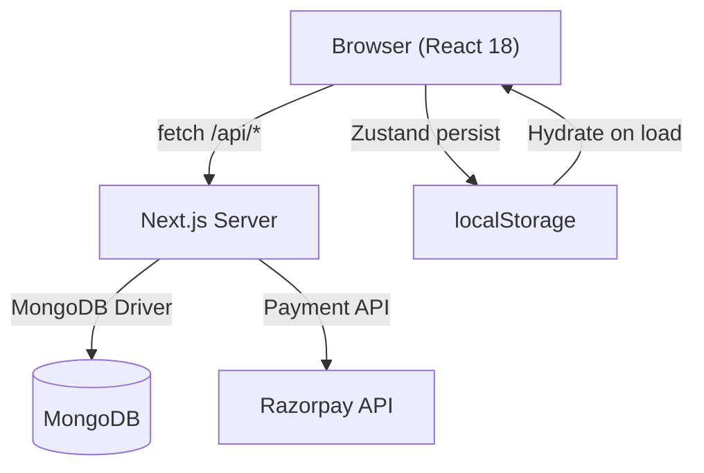
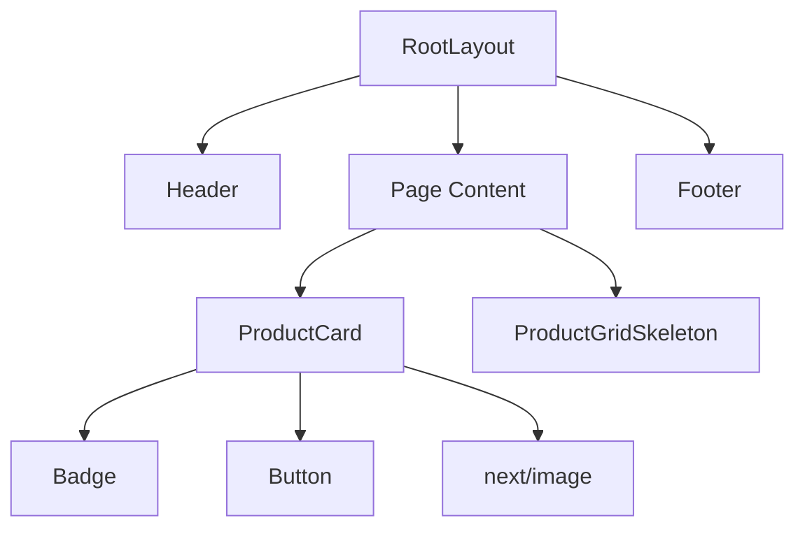
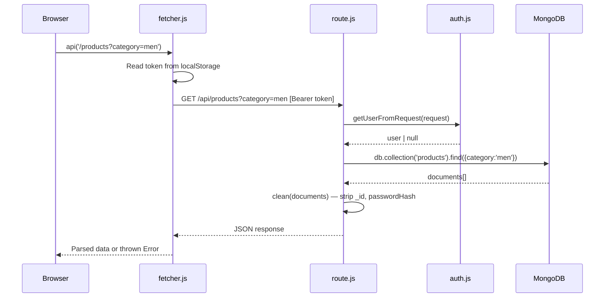
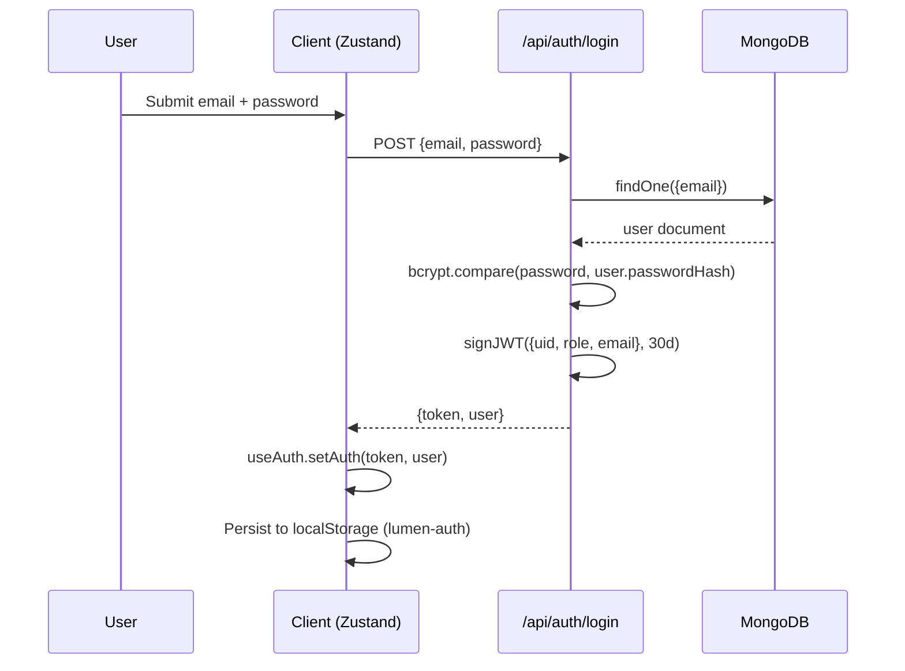
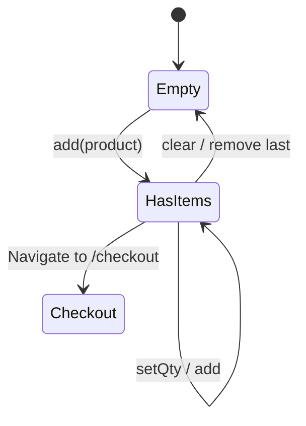
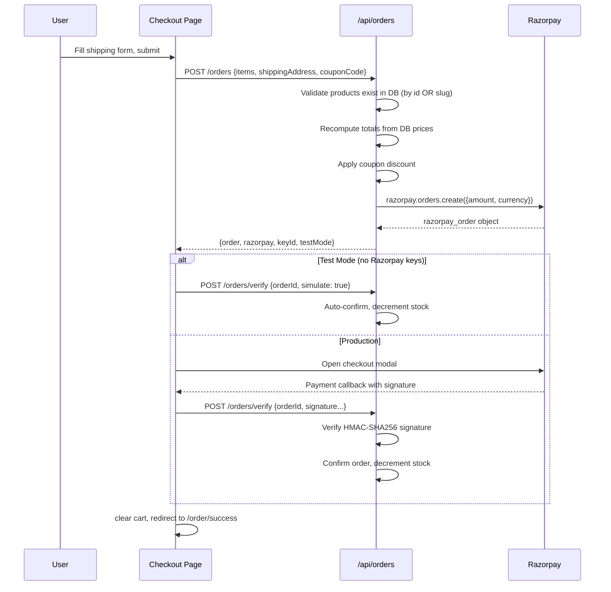
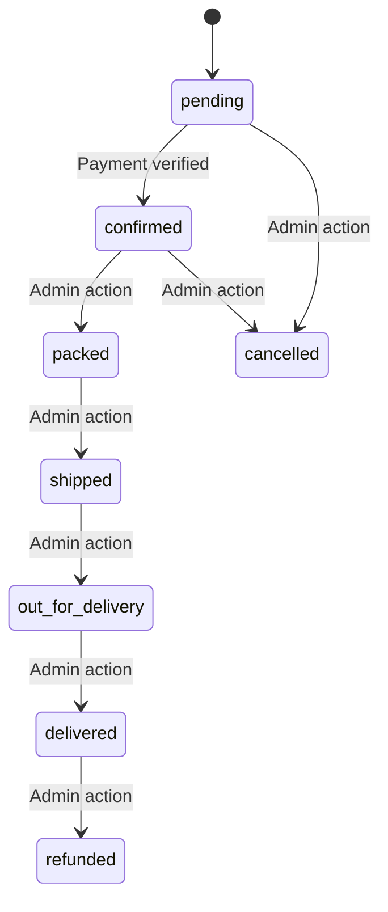
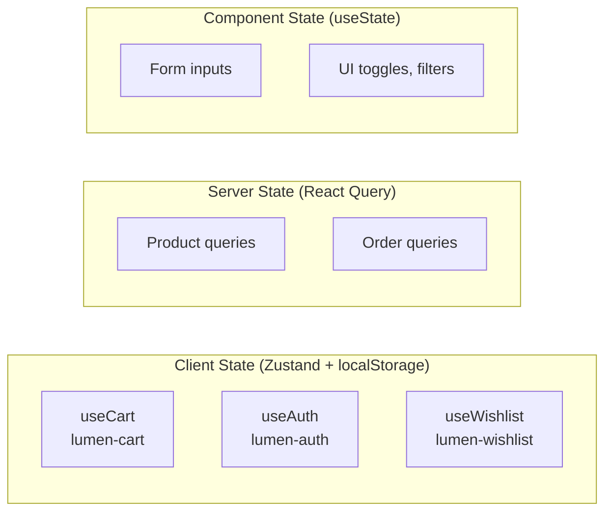

# Project Architecture

Internal engineering documentation for **Lumen Commerce**.

Last updated: June 2026

---

## 1. System Overview

Lumen Commerce is a monolithic Next.js 15 application serving both the storefront and admin panel. It uses a catch-all API route pattern (`/api/[[...path]]`) rather than individual route files, with MongoDB as the sole data store and Razorpay for payment processing.

Key design decisions:

- **Client-side rendering throughout** — All pages use `'use client'`. No SSR/SSG. SEO is sacrificed for development simplicity.
- **Single API handler** — One `route.js` file handles all backend logic via URL pattern matching.
- **Lazy database connection** — MongoDB connects on the first API request, not at startup.
- **Graceful offline mode** — When MongoDB is unreachable, the storefront renders bundled seed data as a read-only catalog.
- **Stateless auth** — JWT tokens with embedded roles. No server-side sessions.

---

## 2. High Level Architecture



The system has three runtime components:

1. **Next.js process** — Serves both static assets (client bundles) and API requests
2. **MongoDB** — Stores products, users, orders, reviews, categories
3. **Razorpay** — External payment gateway (optional; system functions without it in test mode)

---

## 3. Application Layers

```
┌─────────────────────────────────────────────────────┐
│  Presentation Layer (React Components)              │
│  - Pages (app/*)                                    │
│  - UI Components (components/ui/*)                  │
│  - Site Components (components/site/*)              │
├─────────────────────────────────────────────────────┤
│  Client State Layer (Zustand)                       │
│  - useCart (lumen-cart)                              │
│  - useAuth (lumen-auth)                             │
│  - useWishlist (lumen-wishlist)                     │
├─────────────────────────────────────────────────────┤
│  Data Fetching Layer                                │
│  - lib/fetcher.js (api wrapper + auth injection)    │
│  - @tanstack/react-query (caching, 60s stale)       │
├─────────────────────────────────────────────────────┤
│  API Layer (app/api/[[...path]]/route.js)           │
│  - Route matching via regex/string comparison       │
│  - Auth extraction via getUserFromRequest()         │
│  - Business logic inline                            │
├─────────────────────────────────────────────────────┤
│  Data Access Layer                                  │
│  - lib/mongo.js (connection pooling, lazy init)     │
│  - lib/auth.js (JWT + bcrypt)                       │
│  - Direct MongoDB driver calls (no ORM)             │
├─────────────────────────────────────────────────────┤
│  Database (MongoDB)                                 │
│  - Collections: products, users, orders, reviews,   │
│    categories                                       │
│  - UUID-based IDs (not ObjectId)                    │
│  - Indexes on slug, email, userId, paymentStatus    │
└─────────────────────────────────────────────────────┘
```

---

## 4. Folder Structure

```
├── app/
│   ├── layout.js               # Root: html, body, Header, Footer, Providers
│   ├── providers.js            # QueryClient, ThemeProvider, Toaster
│   ├── page.js                 # Homepage (featured, best sellers, categories)
│   ├── shop/page.js            # Product listing + filters
│   ├── products/[slug]/page.js # Product detail + reviews
│   ├── cart/page.js            # Cart management
│   ├── checkout/page.js        # Address form + payment
│   ├── login/page.js           # Auth: login
│   ├── register/page.js        # Auth: register
│   ├── account/page.js         # Order history + wishlist
│   ├── order/success/page.js   # Post-purchase confirmation
│   ├── admin/page.js           # Admin dashboard (single-page, tabbed)
│   └── api/[[...path]]/route.js # ALL backend logic
├── components/
│   ├── site/                   # Domain components (header, footer, product-card)
│   └── ui/                     # 47 shadcn/ui primitives
├── hooks/                      # use-mobile, use-toast
├── lib/
│   ├── mongo.js                # DB client (server-only, cached on globalThis)
│   ├── auth.js                 # JWT sign/verify, bcrypt hash/compare
│   ├── store.js                # Zustand stores (client-only)
│   ├── fetcher.js              # API helper + currency formatter
│   ├── env.js                  # requireEnv / optionalEnv helpers
│   ├── seed-data.js            # Bundled product catalog for offline fallback
│   ├── seed.mjs                # Database seeding logic
│   └── startup.mjs             # Env validation on startup
├── scripts/
│   ├── run-next.mjs            # Process wrapper (stale process cleanup, signals)
│   └── seed.mjs                # Seed script entry point
├── instrumentation.js          # Next.js instrumentation (env logging)
├── next.config.js              # Standalone output, external packages, headers
└── package.json
```

---

## 5. Component Architecture

### Page Components

Every page is a `'use client'` component that:
1. Reads URL params or Zustand state
2. Calls `api()` inside `useEffect` on mount
3. Manages local state via `useState`
4. Renders UI using shadcn/ui primitives

There are no Server Components in this project.

### Component Hierarchy



### Site Components

| Component | Role |
|-----------|------|
| `Header` | Navigation, search, cart badge, user menu, mobile sheet nav |
| `Footer` | Links, branding |
| `ProductCard` | Image, price, rating, wishlist toggle, add-to-cart |
| `ProductGridSkeleton` | Loading placeholder for product grids |

### UI Library

47 shadcn/ui components based on Radix primitives. Key ones used throughout:

- Layout: `Card`, `Separator`, `Sheet`, `Dialog`, `Tabs`
- Forms: `Input`, `Label`, `Select`, `Textarea`, `Checkbox`, `Switch`, `Slider`
- Feedback: `Badge`, `Button`, `Toast` (via Sonner)
- Data: `Table`

---

## 6. Client → API → Database Flow



### Error Path

If MongoDB is unavailable, the API throws a caught error with code `MONGO_CONNECTION_FAILED`. The catch block returns a 503 with a friendly message. Client-side `.catch()` handlers fall back to bundled seed data for public pages.

---

## 7. Authentication Flow



### Token Structure

```json
{
  "uid": "uuid-v4",
  "role": "admin | customer",
  "email": "user@example.com",
  "iat": 1719000000,
  "exp": 1721592000
}
```

Algorithm: HS256. Expiry: 30 days. Secret: `JWT_SECRET` env var (fallback to `'dev_secret'` in development).

---

## 8. Authorization Flow

Authorization is checked at two levels:

**Client-side (UX only, not security):**
- Admin page checks `user.role !== 'admin'` and redirects to `/account`
- No token → redirect to `/login`

**Server-side (security boundary):**
```javascript
// Every admin endpoint:
if (!user || user.role !== 'admin') return err('Admin only', 403)
```

The token is extracted from the `Authorization` header on every request. There is no middleware — auth is checked inline in the catch-all handler.

---

## 9. Product Flow

### Data Model

```javascript
{
  id: "uuid-v4",
  slug: "heritage-leather-watch",
  name: "Heritage Leather Watch",
  brand: "Lumen",
  category: "accessories",     // references category slug
  price: 8999,
  comparePrice: 14999,
  stock: 24,
  images: ["https://..."],
  description: "...",
  featured: true,
  bestSeller: true,
  newArrival: false,
  rating: 4.8,
  numReviews: 128,
  createdAt: Date
}
```

### Product Listing

The `/api/products` endpoint supports:
- Filters: `category`, `brand`, `featured`, `bestSeller`, `newArrival`, `q` (regex), `min`/`max` (price range)
- Sort: `featured`, `new`, `price-asc`, `price-desc`, `rating`
- Pagination: `page`, `limit` (max 60)

### Offline Fallback

When the API is unreachable, pages fall back to `lib/seed-data.js` which exports `PRODUCTS`, `CATEGORIES`, `FEATURED_PRODUCTS`, `BEST_SELLERS`, `NEW_ARRIVALS`. These are the same 12 products and 6 categories that the seed script inserts into MongoDB.

---

## 10. Cart Flow



Cart is entirely client-side (Zustand + localStorage). No server-side cart exists.

### Cart Item Shape

```javascript
{
  productId: "uuid or slug",  // product.id || product.slug
  name: "Product Name",
  price: 8999,
  image: "https://...",
  slug: "product-slug",
  qty: 1
}
```

The `productId` uses `product.id || product.slug` to handle both API-sourced products (have UUID) and fallback products (only have slug).

---

## 11. Checkout Flow



### Price Recomputation

The server never trusts client-submitted prices. On order creation:
1. Extracts `productId` from each cart item
2. Queries products by `{ $or: [{ id: { $in: ids } }, { slug: { $in: ids } }] }`
3. Computes subtotal from DB prices × quantities
4. Validates coupon server-side
5. Computes shipping (free over ₹1500) + tax (5%)

---

## 12. Order Flow

### Order Statuses



### Order Data Model

```javascript
{
  id: "uuid",
  accessToken: "uuid",        // for guest order access
  userId: "uuid | null",
  userEmail: "string",
  items: [{ productId, name, slug, image, price, qty }],
  shippingAddress: {...},
  subtotal, discount, shipping, tax, total,
  couponCode: "LUMEN10 | null",
  paymentMethod: "razorpay",
  paymentStatus: "pending | paid",
  razorpayOrderId: "string | null",
  razorpayPaymentId: "string | null",
  status: "pending | confirmed | ...",
  statusHistory: [{ status, at: Date }],
  testMode: Boolean,
  createdAt: Date
}
```

---

## 13. Admin Workflow

The admin panel is a single page (`/admin`) with tab-based navigation:

```
Dashboard → Orders → Products → Customers → Analytics → Payments → Inventory → Settings
```

### Data Loading

On mount, the admin page fires 8 parallel API requests:
- `/admin/stats` — Aggregate metrics
- `/admin/orders` — All orders (last 200)
- `/products?limit=60` — Product catalog
- `/admin/users` — User list
- `/admin/analytics` — Sales data (30d/12w/6m)
- `/admin/customers` — Users + spending totals
- `/admin/inventory` — Stock alerts
- `/admin/payments` — Payment records

All are wrapped in `Promise.allSettled` — partial failures don't block the entire dashboard.

### Admin Actions

| Action | Endpoint | Method |
|--------|----------|--------|
| Update order status | `/admin/orders/:id` | PUT |
| Create product | `/products` | POST |
| Update product | `/admin/products/:id` | PUT |
| Delete product | `/admin/products/:id` | DELETE |

---

## 14. Payment Flow

### Razorpay Integration

Two modes of operation:

**Production mode** (Razorpay keys configured):
1. Server creates Razorpay order via `razorpay.orders.create()`
2. Client opens Razorpay checkout modal
3. On success, client sends signature to `/api/orders/verify`
4. Server verifies: `HMAC_SHA256(razorpay_order_id + "|" + razorpay_payment_id, key_secret) === signature`
5. Order confirmed, stock decremented

**Test mode** (keys missing or contain "placeholder"):
1. Server creates order in DB without Razorpay
2. Client immediately calls `/api/orders/verify` with `simulate: true`
3. Server auto-confirms without signature check
4. Order confirmed, stock decremented

The test mode detection happens server-side:
```javascript
const usePlaceholder = !keyId || keyId.includes('placeholder')
```

---

## 15. Database Architecture

### Collections

| Collection | Purpose | Key Indexes |
|------------|---------|-------------|
| `products` | Product catalog | `slug` (unique), `id` (unique), `category + featured + rating` |
| `users` | Customer and admin accounts | `email` (unique) |
| `orders` | Purchase records | `id` (unique), `userId + createdAt`, `paymentStatus + createdAt` |
| `reviews` | Product reviews | `productId + createdAt` |
| `categories` | Product categories | `slug` (unique) |

### ID Strategy

All documents use `id: uuid.v4()` as the application-level identifier. MongoDB's `_id` (ObjectId) exists but is stripped by the `clean()` helper before sending to clients.

### Connection Management

```javascript
// lib/mongo.js — Singleton pattern on globalThis
const globalForMongo = globalThis
let cached = globalForMongo.__mongo

export async function getDb() {
  if (cached.db) return cached.db          // Return cached
  if (!cached.connectPromise) {             // First call: connect
    cached.connectPromise = client.connect()
  }
  return cached.connectPromise              // Concurrent calls share promise
}
```

The `server-only` import prevents accidental client-side bundling of the MongoDB driver.

---

## 16. State Management Architecture



### Store Boundaries

| Store | Persisted | Purpose |
|-------|-----------|---------|
| `useCart` | Yes (localStorage) | Cart items, quantities |
| `useAuth` | Yes (localStorage) | JWT token, user object |
| `useWishlist` | Yes (localStorage) | Array of product IDs/slugs |
| React Query | Memory (60s stale) | API response caching |
| useState | No | Form fields, UI state |

### Data Flow Rule

Client state is the source of truth for cart/auth/wishlist. Server state is the source of truth for products, orders, and user data. The two never conflict because cart items are validated server-side at checkout time.

---

## 17. Error Handling Strategy

### API Layer

```javascript
try {
  const db = await getDb()
  // ... route handling
} catch (e) {
  if (e?.code === 'ENV_MISSING' || ...) return mongoErr(e)  // 500/503
  return err(e.message || 'Internal server error', 500)
}
```

Errors are categorized:
- **ENV_MISSING / MONGO_URL_INVALID** → 500 with config guidance
- **MONGO_CONNECTION_FAILED** → 503 with connection guidance
- **Business logic** → 400/401/403/404 with specific message
- **Unexpected** → 500 with generic message (error logged server-side)

### Client Layer

```javascript
api('/endpoint').then(handleSuccess).catch(() => {
  // Fall back to seed data OR show toast error
})
```

Pages that display products always have a `.catch()` fallback to `lib/seed-data.js`. Pages that perform mutations show error toasts via Sonner.

### MongoDB Error Normalization

`lib/mongo.js` normalizes connection errors into user-friendly messages:
- `ECONNREFUSED` → "MongoDB is not running or unreachable at {host}"
- Timeout → Same message
- Invalid URL → "MONGO_URL must start with mongodb://"

---

## 18. Deployment Architecture

### Build Output

```
next.config.js: output: 'standalone'
```

The standalone build produces a self-contained `./next/standalone` directory with all dependencies inlined. No `node_modules` needed at runtime.

### Runtime Requirements

- Node.js 18+
- MongoDB 5+ (local or Atlas)
- Razorpay account (optional for test mode)

### Environment

The `scripts/run-next.mjs` wrapper handles:
- Stale process cleanup on Windows (kills leftover Next.js processes)
- Signal forwarding (SIGINT, SIGTERM, SIGHUP)
- Graceful shutdown with 5-second force-kill timeout
- Environment validation before starting Next.js

### Security Headers

Applied via `next.config.js`:
- `X-Frame-Options: DENY`
- `Content-Security-Policy: frame-ancestors 'none'`

---

## 19. Future Scalability Notes

### Current Limitations

1. **Single API file** — All 400+ lines of route logic in one file. Will become unwieldy at ~30+ endpoints. Split into individual route modules when needed.

2. **No connection pooling tuning** — Default MongoDB driver pool settings. Fine for single-instance deployment, needs configuration for multi-instance.

3. **No caching layer** — Every API request hits MongoDB. Adding Redis or in-memory caching for product listings would reduce DB load.

4. **Client-side rendering only** — Product pages are invisible to search engines. Migration to Server Components for public pages would improve SEO.

5. **No rate limiting** — Auth endpoints are unprotected against brute force. Add rate limiting before production exposure.

6. **Hardcoded coupons** — Coupon codes are defined in the route handler, not in the database. Moving to a `coupons` collection would enable admin management.

### Recommended Next Steps (by priority)

1. Rate limiting on `/auth/login` and `/auth/register`
2. Server-side rendering for `/shop` and `/products/[slug]` (SEO)
3. Split API route into separate handler modules
4. Add Redis cache for product queries
5. Move coupons to database with admin CRUD
6. Implement image upload (Cloudinary integration exists in env vars)
7. Add email notifications via configured SMTP
8. Implement webhook endpoints for Razorpay payment status updates
